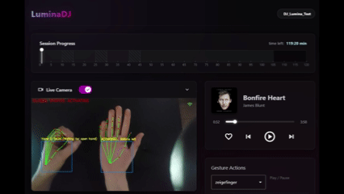
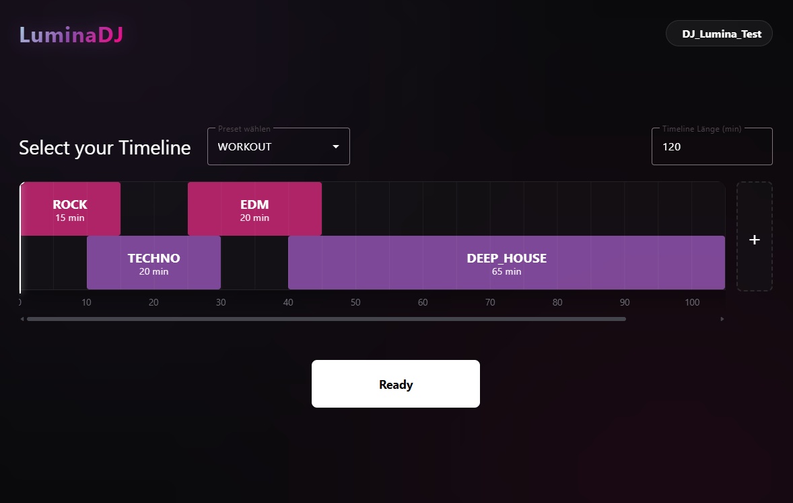
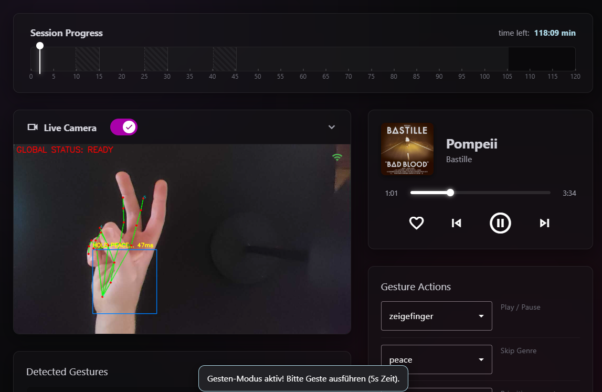
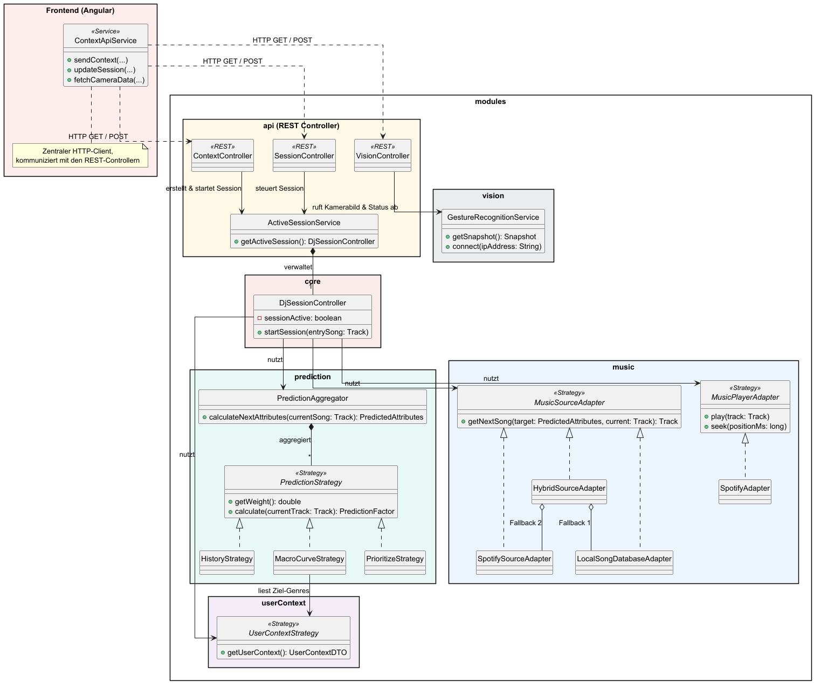
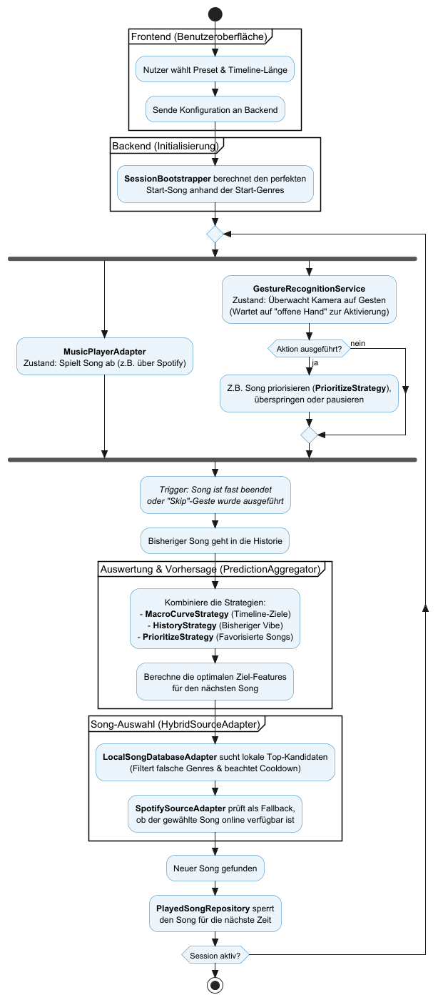

# 🎧 LuminaDJ

  
  
  
  
  

**LuminaDJ** ist dein intelligenter, interaktiver Musik-Player, der sich nahtlos an deine Stimmung anpasst. Anstatt statische Playlists abzuspielen, generiert die Software eine dynamische Reise durch verschiedene Genres und Audio-Features (Macro-Curves).

Das absolute Highlight: Du kannst die Musik komplett freihändig über deine Webcam steuern. Eine fortschrittliche Computer-Vision-Engine im Hintergrund wertet deine Handgesten in Echtzeit aus und ermöglicht es dir, Songs zu pausieren, Genres zu überspringen oder deine Lieblings-Vibes für die KI zu priorisieren.

---

## 📖 Anwendungshandbuch & Demo

### ✨ Freihändige Gestensteuerung
LuminaDJ wartet im Hintergrund intelligent auf deine Eingaben, ohne versehentliche Bewegungen auszuwerten.

  

**So funktioniert's:**
1. **Aktivieren:** Halte die **offene Hand** ✋ für 2 Sekunden still vor die Kamera. Das System meldet sich mit "READY".
2. **Aktion wählen:** Du hast nun 7 Sekunden Zeit für eine Aktion. Forme eine der folgenden Gesten und halte sie kurz (2 Sekunden), um sie einzuloggen:
   * 👆 **Zeigefinger:** Play / Pause
   * ✌️ **Peace:** Aktuelles Genre überspringen (Skip Genre)
   * 👍 **Daumen hoch:** Song liken & Vibe für zukünftige Empfehlungen priorisieren

### 🖥️ Die Benutzeroberfläche

Die App ist übersichtlich aufgebaut und führt dich in zwei simplen Schritten zu deiner perfekten Session:

<table style="width:100%; border: none;">
  <tr>
    <td width="50%" align="center" style="border: none;">
      
        
      <b>1. Session Setup</b> 
      Hier definierst du die Parameter deiner Reise. Lege die Gesamtdauer fest und wähle die gewünschten Genres (z.B. ein fließender Übergang von Acoustic zu Deep-House).
    </td>
    <td width="50%" align="center" style="border: none;">
      
        
      <b>2. Active Session</b> 
      Das Herzstück der App. Oben siehst du das Live-Bild der Kamera-Auswertung. Darunter visualisiert die interaktive Timeline, wo du dich gerade in deinem musikalischen Übergang befindest.
    </td>
  </tr>
</table>

---

## 🏗️ Architektur

LuminaDJ besteht aus einem modernen **Electron/Angular Frontend** und einem leistungsstarken **Spring Boot Java Backend**. Die Kommunikation läuft komplett über REST-APIs.

Ein intelligenter `HybridSourceAdapter` kombiniert eine lokale Vektor-Datenbank (für saubere musikalische Übergänge) mit der Spotify-API (als Fallback).

### 🧩 Klassendiagramm
Das Klassendiagramm zeigt die Entkopplung der Module und den Fokus auf saubere Interfaces (Strategies & Adapters).

  

* **Frontend:** Das Angular-UI greift nur auf REST-Controller zu.
* **Prediction:** Verschiedene Strategien (Timeline, Priorisierung) streiten im `PredictionAggregator` um den perfekten Vibe des nächsten Songs.
* **Music:** Ein hybrider Ansatz garantiert, dass auch bei ausgefallener lokaler Datenbank immer ein Song via Spotify gefunden wird.

### ⚙️ Ablauf der Musik-Session
Das Aktivitätsdiagramm veranschaulicht den Lebenszyklus einer DJ-Session, von der Nutzer-Konfiguration bis zur Berechnung des nächsten Songs. 
Der Prozess läuft in einer Endlosschleife, bis die Session beendet wird. Parallel zur reinen Musikwiedergabe läuft der `GestureRecognitionService` asynchron mit und überwacht die Umgebung auf Nutzereingaben.

  

## 🚀 Projekt starten & bauen

### Voraussetzungen
Bevor du das Projekt zum ersten Mal startest oder baust, musst du sicherstellen, dass dein System vorbereitet ist:

* **Java 21:** Für beide Ausführungsvarianten ist zwingend Java 21 (oder neuer) erforderlich. Prüfe deine aktive Version im Terminal mit dem Befehl:
  `java -version`
* **Abhängigkeiten installieren (einmalig):**
  Bevor du lokal entwickelst, müssen die Pakete für Backend und Frontend heruntergeladen werden.
   * Navigiere in den Ordner `backend` und führe `mvn clean install` aus.
   * Navigiere in den Ordner `frontend` und führe `npm install` aus.

---

### 1. Lokale Entwicklung: "Start LuminaDJ (Full Build)"
Nutze dieses Skript in IntelliJ für die alltägliche Entwicklung und zum Testen der App.
* Führt zuerst im `backend`-Ordner einen Maven-Build (`clean package`) aus.
* Führt danach im `frontend`-Ordner den Befehl `npm run start:desktop` aus.
* **Ergebnis:** Die App startet im lokalen Entwicklungsmodus als Electron-Fenster.

### 2. Release erstellen: "App-Release"
Nutze dieses Skript in IntelliJ, wenn du eine fertige, installierbare App (z. B. als `.exe`) generieren möchtest.
* Führt ebenfalls zuerst im `backend`-Ordner einen Maven-Build (`clean package`) aus.
* Führt danach im `frontend`-Ordner den Befehl `npm run build:app` aus.
* **Ergebnis:** Der Electron-Builder verpackt das Frontend sowie die gebaute Backend-`.jar` und legt das fertige Setup im Ordner `frontend/release/` ab.